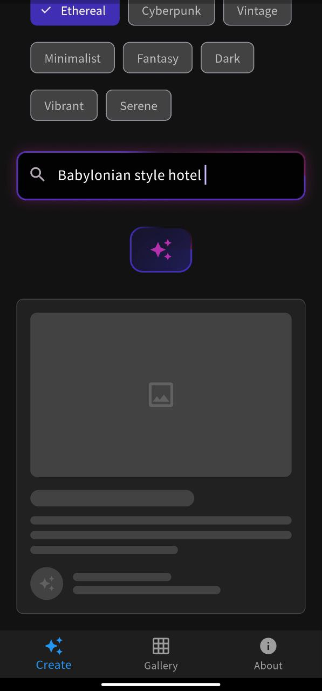

### Project Description: **Dreamscape AI** 🎨✨

---

#### **Project Idea**  
**Dreamscape AI** is an innovative Flutter application that transforms your imagination into digital art using artificial intelligence. The app features an interactive user interface with stunning visual effects and allows you to:  
- Create unique images based on text descriptions.  
- Choose an artistic "mood" (e.g., **Ethereal** or **Cyberpunk**) to influence the style of generated images.  
- Save and share your creations with friends.  
- Explore a gallery of previous artworks with filters for mood and text search.  


<div align="center">
  
</div>

---

#### **Key Features**  
1. **Rich UI/UX Design**:  
   - Glowing buttons and dynamic animations.  
   - Responsive layouts with shadow and gradient effects.  

2. **Integration with Hugging Face API**:  
   - Uses the **Stable Diffusion 3.5** model to generate images.  
   - Error handling and user-friendly feedback for failed requests.  

3. **Image Management**:  
   - Save generated images locally using `path_provider`.  
   - Share images via other apps using `share_plus`.  

4. **Security**:  
   - Request user permissions for phone calls (e.g., the "Call" button in the **About** section).  
   - Separate sensitive keys from the codebase (recommended: use `.env`).  

---

#### **Technologies Used**  
- **Flutter**: Core framework.  
- **Key Packages**:  
  - `http`: For API communication.  
  - `permission_handler`: To manage system permissions.  
  - `share_plus`: For image sharing.  
  - `url_launcher`: To open external links.  
- **Design**:  
  - `ShaderMask` for gradient effects.  
  - `AnimatedBuilder` for complex animations.  

---

#### **How to Run**  
1. **Install Dependencies**:  
   ```bash
   flutter pub get
   ```

2. **Set Up Secrets**:  
   - Create a `.env` file in the project root and add your Hugging Face API token:  
     ```
     HUGGING_FACE_TOKEN=your_api_token_here
     ```  
   - Add `.env` to `.gitignore` to avoid exposing secrets.  

3. **Run the App**:  
   ```bash
   flutter run
   ```

---

#### **Screenshots**  
| Create Art 🖼️ | Gallery 📚 | About ℹ️ |  
|----------------|-----------|---------------------|  
|  |  |  |  

---

#### **Future Development Notes**  
- Add multi-language support.  
- Improve performance with **Cached Network Images**.  
- Implement cloud storage via Google/Facebook login.  

---

#### **License**  
This project is licensed under the [MIT License](https://opensource.org/licenses/MIT).  

---

**✨ Thank you for exploring Dreamscape AI!**  
Don’t forget to ⭐️ star the repo if you like it!
